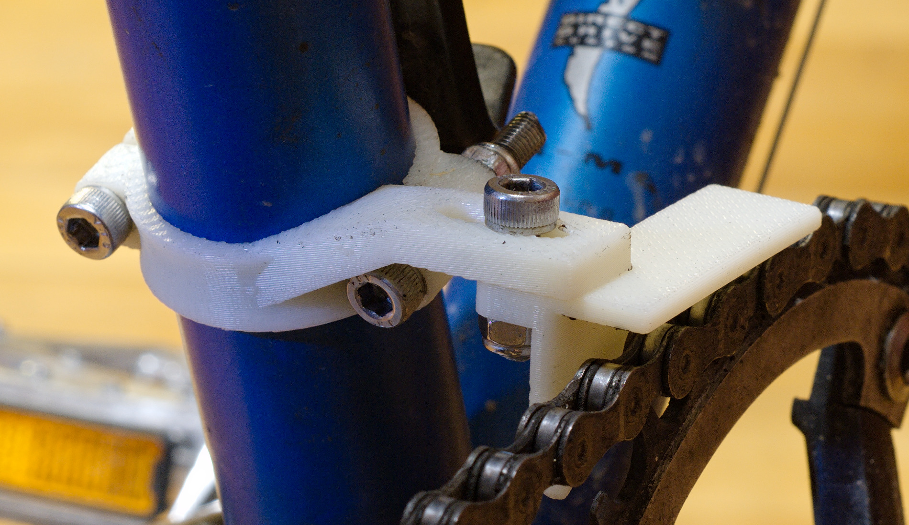

This is a CAD model for a chain keeper for 1x drivetrains.  The stl meshes are
included for your convenience, but the source file is provided if you need to
make any modifications (e.g. to change the seatpost diameter, number of
chainring teeth, etc.).  It is nearly fully parametric, and that will improve
as I make more of them for different bikes.

I've 3D printed the included stl meshes, and installed it on my bike:

To edit the file and produce new meshes, you need FreeCAD >= 0.16.

This design is licensed to Troy Sankey <sankeytms at gmail dot com> under the
GNU GPLv3 (see COPYING.txt).
